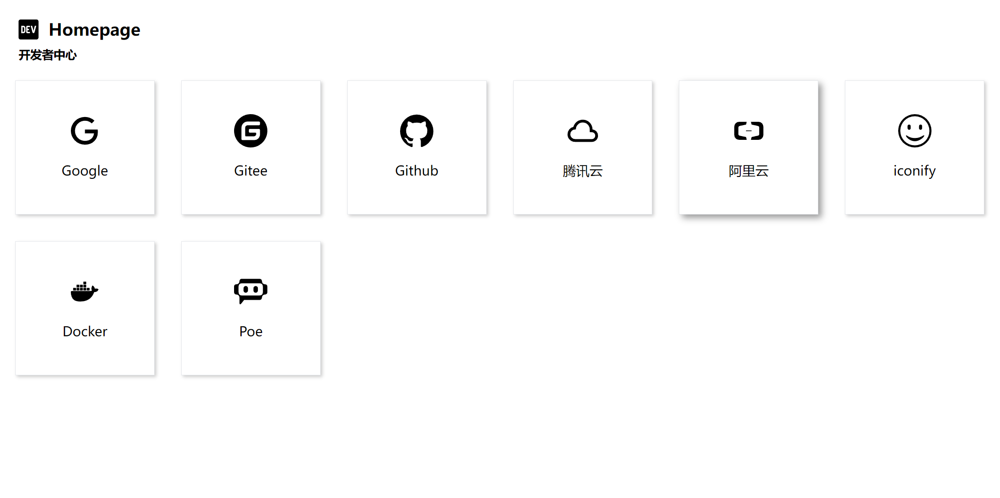

# Homepage

It is a small [homepage](https://homepage.gmfan.cn/) project that allows custom tool lists and restricts IP access.



## Install

```shell
git clone https://github.com/tkgfan/homepage.git

go mod tidy

go run main.go
```

## Deployment

Use docker-compose for quick deployment.

```yaml
version: '3.8'
services:
  app:
    image: 'gmfan/homepage:v0.0.1-release'
    container_name: homepage
    restart: always
    environment:
      - ACCESS_LIST=["0.0.0.0/0"]
      - UPDATE_PATH=upload
    ports:
      - '38001:8888'
```

Parameter explanations:

- `ACCESS_LIST`: List of allowed IP addresses to access.
- `UPDATE_PATH`: Custom path for updating configurations.

To update the configuration information at the `UPDATE_PATH` using a POST request and achieve a custom list, the configuration parameters should follow the following format:

```rest
POST /UPDATE_PATH

{
    "header":{
        "icon":"https://api.iconify.design/bxl:dev-to.svg",
        "title":"Homepage",
        "subTitle":"开发者中心"
    },
    "links":[
        {
            "icon":"https://api.iconify.design/mdi:google.svg",
            "title":"Google",
            "url":"https://www.google.com/"
        }
    ]
}
```
